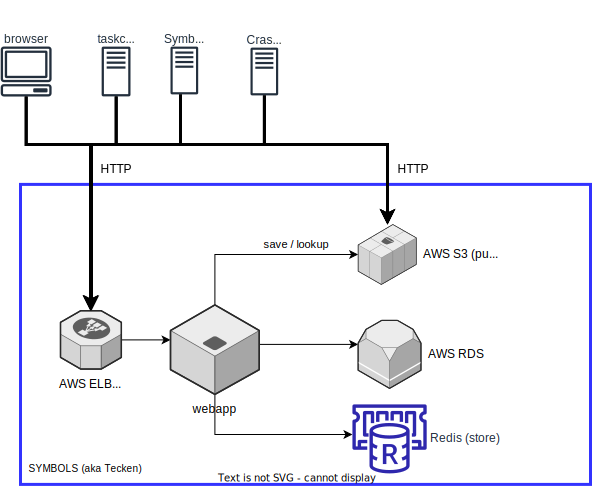

========
Overview
========

.. contents::
   :local:

What is Tecken?
===============

Tecken is the Mozilla Symbols Server which manages
:term:`symbols files <symbols file>` generated by builds of Mozilla products
(:ref:`upload <upload>`, :ref:`download <download>`).

Architecture
============

Rough architecture diagram of Tecken:

**Symbols service (aka symbols.mozilla.org):**

Host: https://symbols.mozilla.org/

The symbols webapp handles upload and download of symbols.

* **upload:** The webapp handles incoming uploads with the upload API. It
  manages upload permissions and bookkeeping of what was uploaded, by whom,
  and when. It exposes an interface for debugging symbol upload problems.

* **download:** The webapp handles download API requests by finding the
  symbol file in one of the AWS S3 buckets and returning an HTTP redirect
  to the final location.

Code is in the `tecken
<https://github.com/mozilla-services/tecken/tree/main/tecken>`_ subdirectory.

Repository structure
====================

Here's a bunch of top-level directories and what's in them::

    bin/                    -- scripts for running and developing
    docker/                 -- Dockerfile and image building bits
    docs/                   -- documentation
    favicons/               -- favicons used by Symbols webapp
    frontend/               -- Symbols webapp JavaScript frontend
    schemas/                -- API schemas
    tecken/                 -- Symbols service unit tests and code

These directories have test stuff in them::

    systemtests/            -- systemtests for Symbols Server

.. Note::

   Originally, there was just Tecken which handled upload, download, and
   :term:`symbolication`. Then we split symbolication into a separate service
   named `Mozilla Symbolication Server
   <https://symbolication.services.mozilla.com/>`__.

The Logo
========

|logo|

The `logo <https://www.iconfinder.com/icons/118754/ampersand_icon>`_
comes from `P.J. Onori <http://www.somerandomdude.com/>`_ and is
licensed under `Attribution-Non-Commercial 3.0
Netherlands <http://creativecommons.org/licenses/by-nc/3.0/nl/deed.en_GB>`_.

.. |logo| image:: logo.png
