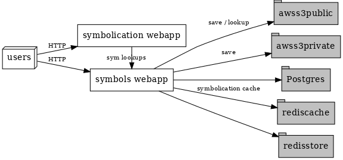

========
Overview
========

.. contents::
   :local:

What is Tecken?
===============

Tecken is an umbrella project consisting of two services:

1. Mozilla Symbols Server which manages symbols generated by builds of Mozilla
   products (:ref:`upload <upload>`, :ref:`download <download>`).
2. Mozilla Symbolication Server which has a symbolication API for converting
   memory addresses into symbols (:ref:`symbolication <symbolication>`).

Architecture
============

Rough architecture diagram of Tecken:

Important services in the diagram:

* **Symbols service (aka symbols.mozilla.org):**

  Host: https://symbols.mozilla.org/

  The symbols webapp handles upload and download of symbols.

  * **upload:** The webapp handles incoming uploads with the upload API. It
    manages upload permissions and bookkeeping of what was uploaded, by whom,
    and when. It exposes an interface for debugging symbol upload problems.

  * **download:** The webapp handles download API requests by finding the
    symbol file in one of the AWS S3 buckets and returning an HTTP redirect
    to the final location.

  .. Warning::

     The Symbols service also has a symbolication API. This version of the
     symbolication API is deprecated. Please switch to using the Symbolication
     service at https://symbolication.services.mozilla.com/ instead.

  Code is in the `tecken
  <https://github.com/mozilla-services/tecken/tree/main/tecken>`_ subdirectory.

* **Sybmolication service (aka symbolication.services.mozilla.com):**

  Host: https://symbolication.services.mozilla.com/

  The symbolication webapp is a symbolication API microservice that uses the `Symbolic
  library <https://github.com/getsentry/symbolic>`_ to parse SYM files and do
  symbol lookups.

  Code is in the `eliot-service
  <https://github.com/mozilla-services/tecken/tree/main/eliot-service>`_
  subdirectory.

Repository structure
====================

Here's a bunch of top-level directories and what's in them::

    bin/                    -- scripts for running and developing
    docker/                 -- Dockerfile and image building bits
    docs/                   -- documentation
    favicons/               -- favicons used by Symbols webapp
    frontend/               -- Symbols webapp JS frontend
    schemas/                -- API schemas

These directories have test stuff in them::

    systemtests/            -- systemtests for Symbolication and Symbols services

These directories hold code for the Tecken webapp service and the Eliot
symbolication service::

    eliot-service/          -- Symbolication service unit tests and code (Eliot)
    tecken/                 -- Symbols service unit tests and code

.. Note::

   Originally, there was just Tecken which handled upload, download, and
   symbolication. Then we split symbolication into a separate service
   codenamed Eliot [#eliotname]_.

   Now "Tecken" refers to the overall project covering both the Mozilla Symbols
   and Mozilla Symbolication services. But in the code "tecken" refers to
   Mozilla Symbols service and "eliot" refers to the Mozilla Symbolication
   service.

   .. [#eliotname] Tecken Symoblication -> TS Eliot.
